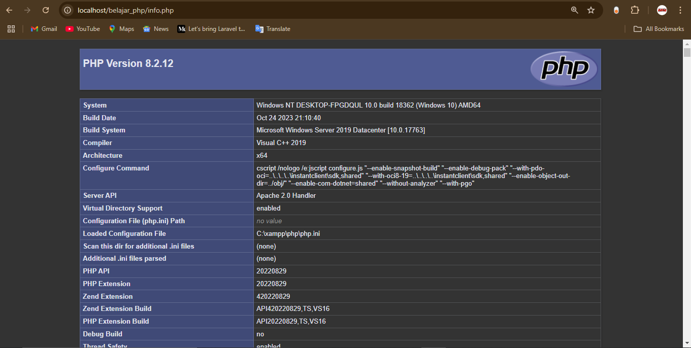

---


# Repo belajar PHP

## Apa itu php?

Hypertext Preprocessor (PHP) adalah bahasa skrip sisi server open-source yang umum digunakan di bidang pengembangan web. Bahkan, saat ini PHP digunakan oleh 78,1% dari seluruh website yang ada di dunia, termasuk Facebook dan Wikipedia.

Bahasa skrip ini tersedia di semua sistem operasi utama, seperti Linux, Microsoft Windows, dan macOS. Sebagian besar web server, termasuk Apache dan IIS, juga mendukung PHP.
sumber: https://www.hostinger.co.id/ 

## cara menjalankan php
 Untuk menjalankan program PHP, kita membutuhkan web server. Beberapa pilihan web server gratis yang lengkap dan populer adalah:

1. XAMPP
2. Laragon
3. Nginx
4. WAMP
5. MAMP
6. Apache
7. Lighttpd
8. IIS (Internet Information Services)
9. EasyPHP
10. UwAmp

silahkan install salah satu webserver yang tersedia, tetapi saya sarankan menggunkana xampp bagi pemula.
setelah diinstall buka direktori ``` C:\xampp\htdocs ``` jika sudah dibuka, silahkan buat folder misal ``` belajar_php``` jadi ```C:\xampp\htdocs\belajar_php```

ketik cmd, ```code .``` berfungsi untuk membuka teks editor yaitu visual stduio code.  


## - Menampilkan teks di php
```php
<?php echo "Hello world"; ?>
```
tampilan di browser

 
 ## - Cek versi php 
 
 <p> cek versi php yang kita gunakan saat ini ada beberapa cara sebagai berikut:

 - #### Menggunakan terminal
 ketik saja ```php -v```
 
 - #### Menggunakan syntak
 ```php
 <?php
 phpinfo();
 ?>
 ```
 disini kita bisa cek dengan lengkap konfigurasi yang saat ini kita gunakan
 


## Kontrol dan Perulangan

Kode ini mendemonstrasikan penggunaan berbagai struktur kontrol dan perulangan dalam PHP. Berikut adalah penjelasan untuk setiap bagian kode:

## 1. **If Statement**
```php
$nilaiujian = 70; // Variabel $nilaiujian diatur dengan nilai 70
if ($nilaiujian > 80) {
    echo "Anda Lulus <br>";
} else {
    echo "Anda Tidak Lulus <br>";
}
```
### Penjelasan:
- Mengevaluasi kondisi menggunakan `if-else`.
- Jika nilai `$nilaiujian` lebih besar dari 80, maka menampilkan "Anda Lulus".
- Jika tidak, menampilkan "Anda Tidak Lulus".

## 2. **Switch Statement**
```php
$hari = "senin"; // Variabel $hari diatur dengan nilai "senin"
switch ($hari) {
    case "senin":
        echo "Hari ini adalah hari Senin <br>";
        break;
    case "selasa":
        echo "Hari ini adalah hari Selasa";
        break;
    case "rabu":
        echo "Hari ini adalah hari Rabu";
        break;
    // ...
}
```
### Penjelasan:
- `switch` digunakan untuk mengevaluasi beberapa kasus berdasarkan nilai `$hari`.
- Menampilkan pesan yang sesuai dengan nilai `$hari`.
- `break` menghentikan eksekusi agar tidak masuk ke kasus berikutnya.

## 3. **For Loop**
```php
for ($a = 0; $a < 10; $a++) {
    echo "Ini adalah perulangan ke $a <br>";
}
```
### Penjelasan:
- Perulangan dengan jumlah iterasi tetap (10 kali).
- Setiap iterasi, nilai `$a` bertambah 1.
- Menampilkan teks "Ini adalah perulangan ke" diikuti dengan nomor iterasi.

## 4. **While Loop**
```php
$b = 1; // Inisialisasi variabel $b
while ($b < 10) {
    echo "Ini adalah perulangan ke $b <br>";
    $b++; // Nilai $b bertambah 1 setiap iterasi
}
```
### Penjelasan:
- Perulangan dijalankan selama kondisi `$b < 10` terpenuhi.
- Menampilkan teks "Ini adalah perulangan ke" diikuti dengan nilai `$b`.

## 5. **Do-While Loop**
```php
$c = 0; // Inisialisasi variabel $c
do {
    echo "Ini adalah perulangan ke $c <br>";
    $c++;
} while ($c < 10);
```
### Penjelasan:
- Sama seperti `while`, tetapi akan selalu menjalankan blok kode setidaknya sekali sebelum memeriksa kondisi.
- Menampilkan teks "Ini adalah perulangan ke" diikuti dengan nilai `$c`.

## 6. **Foreach Loop**
```php
$array = ["Nola", "Rifqi", "Fika", "Aldo", "Ayaz"];
foreach ($array as $d) {
    echo "Nama siswa adalah $d <br>";
}
```
### Penjelasan:
- `foreach` digunakan untuk iterasi elemen-elemen dalam array `$array`.
- Setiap elemen akan disimpan sementara dalam variabel `$d`.
- Menampilkan teks "Nama siswa adalah" diikuti dengan nilai elemen array.

---

## Fungsi Utama `echo`
- `echo` digunakan untuk menampilkan teks atau nilai variabel ke output (biasanya ke browser).
- Contoh:
  - `echo "Anda Lulus <br>";` menampilkan teks "Anda Lulus".
  - `echo "Nama siswa adalah $d <br>";` menampilkan nama siswa dari array.

---

## Algoritma Utama
1. Mengevaluasi nilai ujian dengan `if-else` untuk menentukan lulus atau tidak.
2. Menggunakan `switch` untuk mencocokkan nilai hari dengan pesan yang sesuai.
3. Melakukan iterasi dengan `for`, `while`, dan `do-while` untuk menampilkan daftar perulangan.
4. Menggunakan `foreach` untuk memproses setiap elemen dalam array.

---
